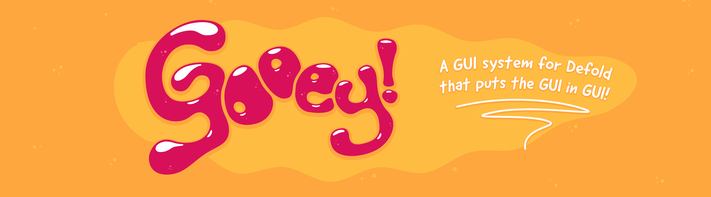
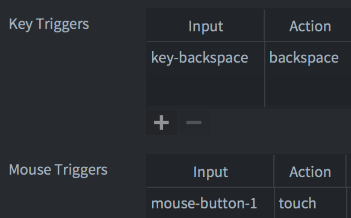
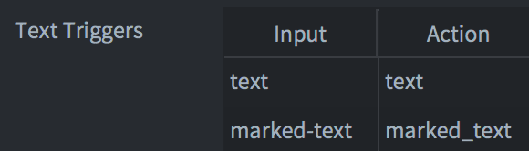
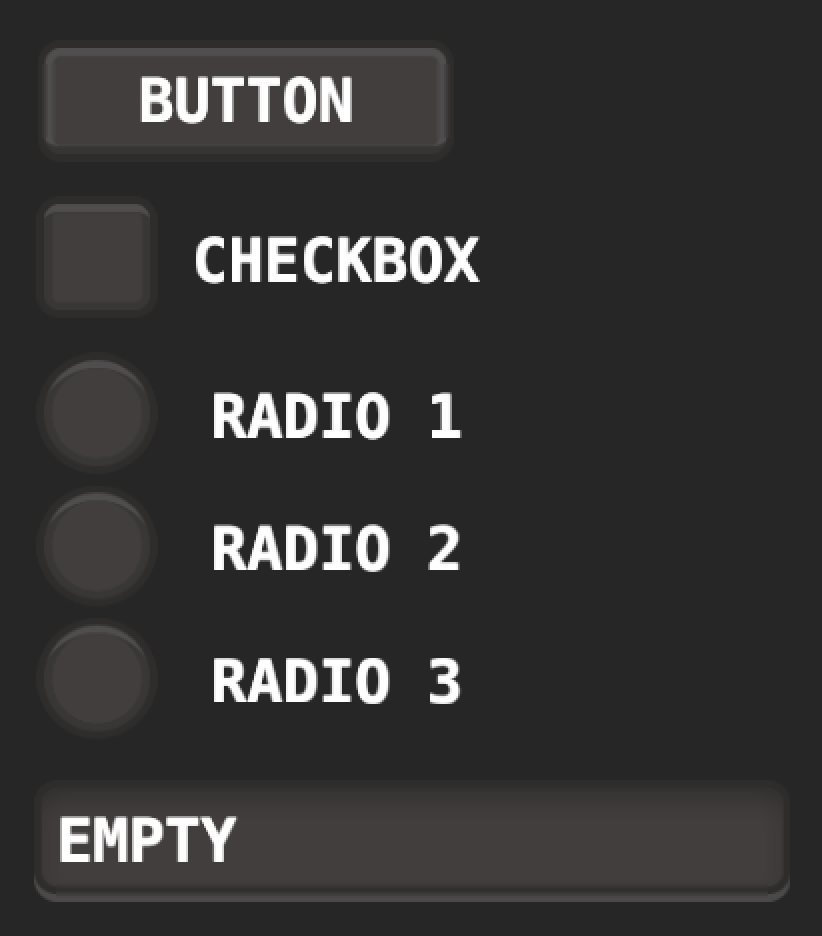
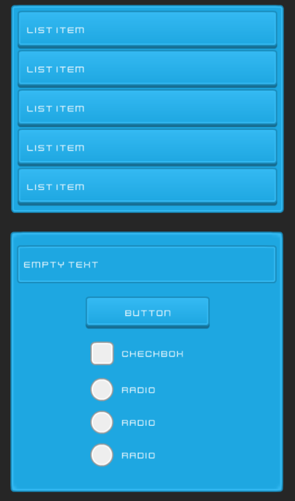

[](https://travis-ci.org/britzl/gooey)
# Gooey
Gooey is a GUI system for the [Defold](https://www.defold.com) game engine. It is inspired by the excellent [Dirty Larry](https://github.com/andsve/dirtylarry) library.


# Installation
You can use Gooey in your own project by adding this project as a [Defold library dependency](http://www.defold.com/manuals/libraries/). Open your game.project file and in the dependencies field under project add:

https://github.com/britzl/gooey/archive/master.zip

Or point to the ZIP file of a [specific release](https://github.com/britzl/gooey/releases).


# Usage
The Gooey system is encapsulated in a single Lua module without any visual components. It makes very little assumptions of the look and feel of the UI components it supports. Instead Gooey focuses on providing stable input and state handling and lets the user decide which states matter and how they should be presented visually.


## Input bindings
For Gooey to work it requires a couple of input bindings:

* Mouse trigger - ```mouse-button-1``` -> ```touch```
* Mouse trigger - ```mouse-wheel-up``` -> ```scroll_up``` (for scrolling in lists)
* Mouse trigger - ```mouse-wheel-down``` -> ```scroll_down``` (for scrolling in lists)
* Key trigger - ```key-backspace``` -> ```backspace``` (for text input)
* Text trigger - ```text``` -> ```text``` (for text input)
* Text trigger - ```marked-text``` -> ```marked_text``` (for text input)




The input binding constants listed above are defined in `gooey/actions.lua` and can be changed.

**IMPORTANT NOTE ON ANDROID**: Make sure that the Input Method in the Android section of the game.project file is set to HiddenInputField. This will ensure that virtual keyboard input works properly.

### Multi-touch
Gooey supports multi-touch for clickable components as long as the following input binding exists:

* Touch trigger - ```multi-touch``` -> ```multitouch```


## Supported components
Gooey supports the following component types:

* Button - ```gooey.button()```
* Checkbox - ```gooey.checkbox()```
* Radio button - ```gooey.radio()```
* Input text - ```gooey.input()```
* Lists (static and dynamic):
  * ```gooey.static_list()``` All list item nodes are already added to the list. Good for showing a small data set or when the list item nodes should vary in composition and looks.
  * ```gooey.dynamic_list()``` All list item nodes are created from the same template. The nodes are reused when scrolling. Good for showing a large data set.
* Scrollbar - ```gooey.scrollbar```


### gooey.button(node_id, action_id, action, fn, refresh_fn)
Perform input and state handling for a button

**PARAMETERS**
* ```node_id``` (string|hash) - Id of the node representing the clickable area, typically the background of the button
* ```action_id``` (hash) - Action id as received from on_input()
* ```action``` (table) - Action as received from on_input()
* ```fn``` (function) - Function to call when the button is clicked/tapped on. A button is considered clicked/tapped if both a pressed and released action has been detected inside the bounds of the node. The function will get the same state table as described below passed as its first argument
* ```refresh_fn``` (function) - Optional function to call when the state of the button has been updated. Use this to update the visual representation.

**RETURN**
* ```button``` (table) - State data for the button based on current and previous input actions

The state table contains the following fields:

* ```node``` (node) - The node itself
* ```enabled``` (boolean) - true if the node is enabled
* ```consumed``` (boolean) - true if the input was consumed
* ```clicked``` (boolean) - true if the input is considered a click (ie pressed and released cycle)
* ```over``` (boolean) - true if user action is inside the node
* ```over_now``` (boolean) - true if user action moved inside the node this call
* ```out_now``` (boolean) - true if user action moved outside the node this call
* ```pressed``` (boolean) - true if the button is pressed
* ```pressed_now``` (boolean) - true if the button was pressed this call
* ```released_now``` (boolean) - true if the button was released this call

**EXAMPLE**

	local gooey = require "gooey.gooey"

	local function update_button(button)
		if button.pressed_now then
			gui.play_flipbook(button.node, hash("button_pressed"))
		elseif button.released_now then
			gui.play_flipbook(button.node, hash("button_normal"))
		elseif not button.pressed and button.over_now then
			gui.play_flipbook(button.node, hash("button_over"))
		elseif not button.pressed and button.out_now then
			gui.play_flipbook(button.node, hash("button_normal"))
		end
	end

	local function on_pressed(button)
		print("pressed")
	end

	function on_input(self, action_id, action)
		gooey.button("button/bg", action_id, action, on_pressed, update_button)
	end

**STATE**
It is possible to set the state of a button:

    update_button(gooey.button("button/bg").set_visible(false))


### gooey.checkbox(node_id, action_id, action, fn, refresh_fn)
Perform input and state handling for a checkbox

**PARAMETERS**
* ```node_id``` (string|hash) - Id of the node representing the clickable area
* ```action_id``` (hash) - Action id as received from on_input()
* ```action``` (table) - Action as received from on_input()
* ```fn``` (function) - Function to call when the checkbox is checked/unchecked on. A checkbox is considered checked/unchecked if both a pressed and released action has been detected inside the bounds of the node. The function will get the same state table as described below passed as its first argument
* ```refresh_fn``` (function) - Optional function to call when the state of the checkbox has been updated. Use this to update the visual representation.

**RETURN**
* ```checkbox``` (table) - State data for the checkbox based on current and previous input actions

The state table contains the following fields:

* ```node``` (node) - The node itself
* ```enabled``` (boolean) - true if the node is enabled
* ```consumed``` (boolean) - true if the input was consumed
* ```clicked``` (boolean) - true if the input is considered a click (ie pressed and released cycle)
* ```over``` (boolean) - true if user action is inside the node
* ```over_now``` (boolean) - true if user action moved inside the node this call
* ```out_now``` (boolean) - true if user action moved outside the node this call
* ```checked``` (boolean) - The checkbox state (checked/unchecked)
* ```pressed``` (boolean) - true if the checkbox is pressed (ie mouse/touch down but not yet released)
* ```pressed_now``` (boolean) - true if the checkbox was pressed this call
* ```released_now``` (boolean) - true if the checkbox was released this call
* ```checked_now``` (boolean) - true if the checkbox was checked this call
* ```unchecked_now``` (boolean) - true if the checkbox was unchecked this call

**EXAMPLE**

	local gooey = require "gooey.gooey"

	local function update_checkbox(checkbox)
		if checkbox.released_now then
			if checkbox.checked then
				gui.play_flipbook(checkbox.node, hash("checkbox_checked"))
			else
				gui.play_flipbook(checkbox.node, hash("checkbox_unchecked"))
			end
		elseif not checkbox.pressed and checkbox.over_now then
			gui.play_flipbook(checkbox.node, hash("checkbox_over"))
		elseif not checkbox.pressed and checkbox.out_now then
			gui.play_flipbook(checkbox.node, hash("checkbox_normal"))
		end
	end

	local function on_checked(checkbox)
		print("checked", checkbox.checked)
	end

	function on_input(self, action_id, action)
		gooey.checkbox("checkbox/bg", action_id, action, on_checked, update_checkbox)
	end

**STATE**
It is possible to set the state of a checkbox. This is good for setting the initial state of the checkbox:

	update_checkbox(gooey.checkbox("checkbox/bg").check())
    update_checkbox(gooey.radio("checkbox/bg").set_visible(false))


### gooey.radio(node_id, group, action_id, action, fn, refresh_fn)
Perform input and state handling for a radio button

**PARAMETERS**
* ```node_id``` (string|hash) - Id of the node representing the clickable area
* ```action_id``` (hash) - Action id as received from on_input()
* ```action``` (table) - Action as received from on_input()
* ```fn``` (function) - Function to call when the radio button is selected. A radio button is considered selected if both a pressed and released action has been detected inside the bounds of the node. The function will get the same state table as described below passed as its first argument
* ```refresh_fn``` (function) - Optional function to call when the state of the radiobutton has been updated. Use this to update the visual representation.

**RETURN**
* ```radio``` (table) - State data for the radio button based on current and previous input actions

The state table contains the following fields:

* ```node``` (node) - The node itself
* ```enabled``` (boolean) - true if the node is enabled
* ```consumed``` (boolean) - true if the input was consumed
* ```clicked``` (boolean) - true if the input is considered a click (ie pressed and released cycle)
* ```over``` (boolean) - true if user action is inside the node
* ```over_now``` (boolean) - true if user action moved inside the node this call
* ```out_now``` (boolean) - true if user action moved outside the node this call
* ```selected``` (boolean) - The radio button state
* ```pressed``` (boolean) - true if the radio button is pressed (ie mouse/touch down but not yet released)
* ```pressed_now``` (boolean) - true if the radio button was pressed this call
* ```released_now``` (boolean) - true if the radio button was released this call
* ```selected_now``` (boolean) - true if the radio button was selected this call
* ```deselected_now``` (boolean) - true if the radio button was deselected this call

**EXAMPLE**

	local gooey = require "gooey.gooey"

	local function update_radio(radio)
		if radio.released_now then
			if radio.selected then
				gui.play_flipbook(radio.node, hash("radio_selected"))
			else
				gui.play_flipbook(radio.node, hash("radio_normal"))
			end
		elseif not radio.pressed and radio.over_now then
			gui.play_flipbook(radio.node, hash("radio_over"))
		elseif not radio.pressed and radio.out_now then
			gui.play_flipbook(radio.node, hash("radio_normal"))
		end
	end

	function on_input(self, action_id, action)
		gooey.radio("radio1/bg", "MYGROUP", action_id, action, function(radio)
			print("selected 1", radio.selected)
		end, update_radio)
		gooey.radio("radio2/bg", "MYGROUP", action_id, action, function(radio)
			print("selected 2", radio.selected)
		end), update_radio)
	end

**STATE**
It is possible to set the state of a radiobutton. This is good for setting the initial state of the radiobutton:

    update_radio(gooey.radio("radio1/bg").set_selected(true))
    update_radio(gooey.radio("radio1/bg").set_visible(false))


### gooey.static_list(list_id, stencil_id, item_ids, action_id, action, fn, refresh_fn)
Perform input and state handling for a list of items where the list of nodes has already been created.

**PARAMETERS**
* ```list_id``` (string) - Id of the template containing the list nodes.
* ```stencil_id``` (string|hash) - Id of the stencil node that is used to clip the list. Touch events outside this area will be ignored when it comes to picking of list items.
* ```item_ids``` (table) - Table with a list of list item ids (hash|string)
* ```action_id``` (hash) - Action id as received from on_input()
* ```action``` (table) - Action as received from on_input()
* ```fn``` (function) - Function to call when a list item is selected. A list item is considered selected if both a pressed and released action has been detected inside the bounds of the item. The function will get the same state table as described below passed as its first argument
* ```refresh_fn``` (function) - Optional function to call when the state of the list has been updated. Use this to update the visual representation.

**RETURN**
* ```list``` (table) - State data for the list based on current and previous input actions

The state table contains the following fields:

* ```id``` (string) - The ```list_id``` parameter above
* ```enabled``` (boolean) - true if the node is enabled
* ```consumed``` (boolean) - true if the input was consumed
* ```items``` (table) - The list items as nodes. Each item is presented by a table with keys "root" (node) and "nodes" (table).
* ```over``` (boolean) - true if user action is over any list item
* ```over_item``` (number) - Index of the list item the user action is over
* ```over_item_now``` (number) - Index of the list item the user action moved inside this call
* ```out_item_now``` (number) - Index of the list item the user action moved outside this call
* ```selected_item``` (number) - Index of the selected list item
* ```pressed_item``` (number) - Index of the pressed list item (ie mouse/touch down but not yet released)
* ```pressed_item_now``` (number) - Index of the list item the user action pressed this call
* ```released_item_now``` (number) - Index of the list item the user action released this call
* ```scroll``` (vector3) - Scrolled amount from the top (only scroll.y is used). The scroll amount is in the range 0.0 (top) to 1.0 (bottom).

**EXAMPLE**

	local gooey = require "gooey.gooey"

	local function update_list(list)
		for i,item in ipairs(list.items) do
			if item.index == list.pressed_item then
				gui.play_flipbook(item.root, hash("item_pressed"))
			elseif item.index == list.selected_item then
				gui.play_flipbook(item.root, hash("item_selected"))
			else
				gui.play_flipbook(item.root, hash("item_normal"))
			end
		end
	end

	local function on_item_selected(list)
		print("selected", list.selected_item)
	end

	function on_input(self, action_id, action)
		gooey.static_list("list", "list/stencil", { "item1/bg", "item2/bg", "item3/bg", "item4/bg", "item5/bg" }, action_id, action, on_item_selected, update_list)
	end

**STATE**
It is possible to set the scroll amount of a list. This is useful when updating a list based on the movement of a scrollbar:

    -- scroll 75% of the way
    gooey.static_list("list", "list/stencil", { "item1/bg", "item2/bg", "item3/bg", "item4/bg", "item5/bg" }).scroll_to(0, 0.75)


### gooey.dynamic_list(list_id, root_id, stencil_id, item_id, data, action_id, action, fn, refresh_fn)
Perform input and state handling for a list of items where list item nodes are created dynamically and reused. This is preferred for large data sets.

**PARAMETERS**
* ```list_id``` (string) - Id of the template containing the list nodes.
* ```stencil_id``` (string|hash) - Id of the stencil node that is used to clip the list. Touch events outside this area will be ignored when it comes to picking of list items. The size of this area will decide how many list item nodes to create. The system will create enough to fill the area plus one more to support scrolling.
* ```item_id``` (string|hash) - Id of the single list item that is to be cloned to present the list data.
* ```data``` (table) - Data to associate with the list. This decides how far the list of possible to scroll.
* ```action_id``` (hash) - Action id as received from on_input()
* ```action``` (table) - Action as received from on_input()
* ```fn``` (function) - Function to call when a list item is selected. A list item is considered selected if both a pressed and released action has been detected inside the bounds of the item. The function will get the same state table as described below passed as its first argument
* ```refresh_fn``` (function) - Optional function to call when the state of the list has been updated. Use this to update the visual representation.

**RETURN**
* ```list``` (table) - State data for the list based on current and previous input actions

The ```list``` table contains the following fields:

* ```id``` (string) - The ```list_id``` parameter above
* ```enabled``` (boolean) - true if the node is enabled
* ```consumed``` (boolean) - true if the input was consumed
* ```items``` (table) - The list items as nodes. See below for table structure.
* ```over``` (boolean) - true if user action is over any list item
* ```over_item``` (number) - Index of the list item the user action is over
* ```over_item_now``` (number) - Index of the list item the user action moved inside this call
* ```out_item_now``` (number) - Index of the list item the user action moved outside this call
* ```selected_item``` (number) - Index of the selected list item
* ```pressed_item``` (number) - Index of the pressed list item (ie mouse/touch down but not yet released)
* ```pressed_item_now``` (number) - Index of the list item the user action pressed this call
* ```released_item_now``` (number) - Index of the list item the user action released this call
* ```scroll``` (vector3) - Scrolled amount from the top (only scroll.y is used). The scroll amount is in the range 0.0 (top) to 1.0 (bottom).

The ```items``` table contains list items, each with the following fields:

* ```root``` (node) - The root GUI node of the list item
* ```nodes``` (table) - Node id to GUI node mappings (as returned from gui.clone_tree)
* ```data``` (any) - The data associated with this list item
* ```index``` (number) - Index of the list item

**EXAMPLE**

	local gooey = require "gooey.gooey"

	local function update_list(list)
		for i,item in ipairs(list.items) do
			gui.set_text(item.nodes[hash("listitem/text")], item.data)
		end
	end

	local function on_item_selected(list)
		print("selected", list.selected_item)
	end

	function on_input(self, action_id, action)
		gooey.dynamic_list("list", "list/stencil", "listitem/bg", { "Mr. White", "Mr. Pink", "Mr. Green", "Mr. Blue", "Mr. Yellow" }, action_id, action, on_item_selected, update_list)
	end

**STATE**
It is possible to set the scroll amount of a list. This is useful when updating a list based on the movement of a scrollbar:

    -- scroll 75% of the way
    gooey.dynamic_list("list", "list/stencil", "listitem/bg", { "Mr. White", "Mr. Pink", "Mr. Green", "Mr. Blue", "Mr. Yellow" }).scroll_to(0, 0.75)


### gooey.vertical_scrollbar(handle_id, bounds_id, action_id, action, fn, refresh_fn)
Perform input and state handling for a scrollbar (a handle that can be dragged/scrolled along a bar)

**PARAMETERS**
* ```handle_id``` (string|hash) - Id of the node containing the handle that can be dragged to scroll.
* ```bounds_id``` (string|hash) - Id of the node containing the actual bar that the handle should be dragged along. The size of this area will decide the vertical bounds of the handle.
* ```action_id``` (hash) - Action id as received from on_input()
* ```action``` (table) - Action as received from on_input()
* ```fn``` (function) - Function to call when the scrollbar has been scrolled. The function will get the same state table as described below passed as its first argument
* ```refresh_fn``` (function) - Optional function to call when the state of the list has been updated. Use this to update the visual representation.

**RETURN**
* ```scrollbar``` (table) - State data for the scrollbar

The ```scrollbar``` table contains the following fields:

* ```enabled``` (boolean) - true if the node is enabled
* ```pressed``` (boolean) - true if the handle is pressed (ie mouse/touch down but not yet released)
* ```pressed_now``` (boolean) - true if the handle was pressed this call
* ```released_now``` (boolean) - true if the handle was released this call
* ```over``` (boolean) - true if user action is inside the handle
* ```over_now``` (boolean) - true if user action moved inside the handle this call
* ```out_now``` (boolean) - true if user action moved outside the handle this call
* ```clicked``` (boolean) - true if the input is considered a click (ie pressed and released cycle)
* ```scroll``` (vector3) - Current scroll amount in each direction (0.0 to 1.0)

**EXAMPLE**

	local gooey = require "gooey.gooey"

	local function on_scrolled(scrollbar)
		print("scrolled", scrollbar.scroll.y)
	end

	function on_input(self, action_id, action)
		gooey.vertical_scrollbar("handle", "bounds", action_id, action, on_scrolled)
	end

**STATE**
It is possible to set the scroll amount of a scrollbar. This is useful when updating a scrollbar that belongs to a list when the list was scrolled:

    -- scroll 75% of the way
    gooey.scrollbar("handle", "bounds").scroll_to(0, 0.75)


### gooey.input(node_id, keyboard_type, action_id, action, config, refresh_fn)
Perform input and state handling for a text input field

**PARAMETERS**
* ```node_id``` (string|hash) - Id of the text node
* ```keyboard_type``` (number) - Keyboard type from gui.KEYBOARD_TYPE_*
* ```action_id``` (hash) - Action id as received from on_input()
* ```action``` (table) - Action as received from on_input()
* ```config``` (table) - Optional configuration values.
* ```refresh_fn``` (function) - Optional function to call when the state of the input field has been updated. Use this to update the visual representation.

The configuration table accepts the following values:

* ```max_length``` (number) - Maximum length of entered text
* ```empty_text``` (string) - Text to show if the text field is empty
* ```allowed_characters``` (string) - Lua pattern to filter allowed characters (eg "[%a%d]" for alpha numeric)

NOTE: ```max_length``` currently measures string length in bytes so the value will be misleading for any characters longer than a single byte.

**RETURN**
* ```input``` (table) - State data for the input field based on current and previous input actions

The state table contains the following fields:

* ```node``` (node) - The node itself
* ```enabled``` (boolean) - true if the node is enabled
* ```consumed``` (boolean) - true if the input was consumed
* ```over``` (boolean) - true if user action is inside the node
* ```over_now``` (boolean) - true if user action moved inside the node this call
* ```out_now``` (boolean) - true if user action moved outside the node this call
* ```selected``` (boolean) - true if the text field is selected
* ```pressed``` (boolean) - true if the text field is pressed (ie mouse/touch down but not yet released)
* ```pressed_now``` (boolean) - true if the text field was pressed this call
* ```released_now``` (boolean) - true if the text field was released this call
* ```text``` (string) - The text in the field
* ```marked_text``` (string) - The marked (non-committed) text
* ```keyboard_type``` (number)
* ```masked_text``` (string) - If the keyboard type is gui.KEYBOARD_TYPE_PASSWORD then this string represents a masked version of the text
* ```masked_marked_text``` (string) - If the keyboard type is gui.KEYBOARD_TYPE_PASSWORD then this string represents a masked version of the marked text
* ```text_width``` (number) - The width of the text
* ```marked_text_width``` (number) - The width of the marked text
* ```total_width``` (number) - The total width of the text including marked text

**EXAMPLE**

	local gooey = require "gooey.gooey"

	local function update_input(input)
		if input.selected_now then
			gui.play_flipbook(input.node, hash("input_selected"))
		elseif input.deselected_now then
			gui.play_flipbook(input.node, hash("input_normal"))
		end
	end

	function on_input(self, action_id, action)
		gooey.input("input/text", gui.KEYBOARD_TYPE_DEFAULT, action_id, action, nil, update_input)
	end

**STATE**
It is possible to set the state of an input node:

    update_input(gooey.input("input/text", gui.KEYBOARD_TYPE_DEFAULT).set_visible(false))
    update_input(gooey.input("input/text", gui.KEYBOARD_TYPE_DEFAULT).set_text("foobar"))


## Consuming input
Each Gooey component has a ```consumed``` variable in its state stable. Consuming input in a gui_script to prevent input propagation can be done by checking the consumed state of each component. If any component has ```consumed``` set to true it is safe to return true from the ```on_input()``` function to prevent input propagation. It is also possible to wrap all component interaction in an input group and check the consumed state for the entire group:

    local gooey = require "gooey.gooey"

    function on_input(self, action_id, action)
        local group = gooey.group("group1", function()
            gooey.button("button1/bg", action_id, action, on_pressed, function(button) end)
            gooey.button("button2/bg", action_id, action, on_pressed, function(button) end)
            gooey.radio("radio1/bg", "MYGROUP", action_id, action, function(radio) end, update_radio)
            ...
            -- and so on
        end)
        return group.consumed
    end


## Gooey Themes
Gooey comes shipped with two themes: Dirty Larry and Kenneyblue. You can use these as they are or make a copy and modify. Each theme consists of a Lua module wrapping Gooey, a couple of GUI templates, a font and an atlas containing the visual representation of the components. Use the themes like this:

	local kenneyblue = require "gooey.themes.kenneyblue.kenneyblue"

	function on_input(self, action_id, action)
		kenneyblue.button("button", action_id, action, function(button)
			print("pressed button")
		end)
	end


*Dirty Larry theme*


*Kenneyblue theme*


## Example app
See the [example app](example/) for examples of how to use Gooey on its own and how to use the themes.

[Try the HTML5 version of the example app](http://britzl.github.io/Gooey).


# Credits
* Assets for the Dirty Larry theme from [Dirty Larry](https://github.com/andsve/dirtylarry)
* Assets for the Kenneyblue theme from [Kenney](http://www.kenney.nl)
* Assets for the RPG theme from [Kenney](http://www.kenney.nl)
* Font Alagard used in RPG theme by [Hewett Tsoi](https://www.dafont.com/hewett-tsoi.d4888)
